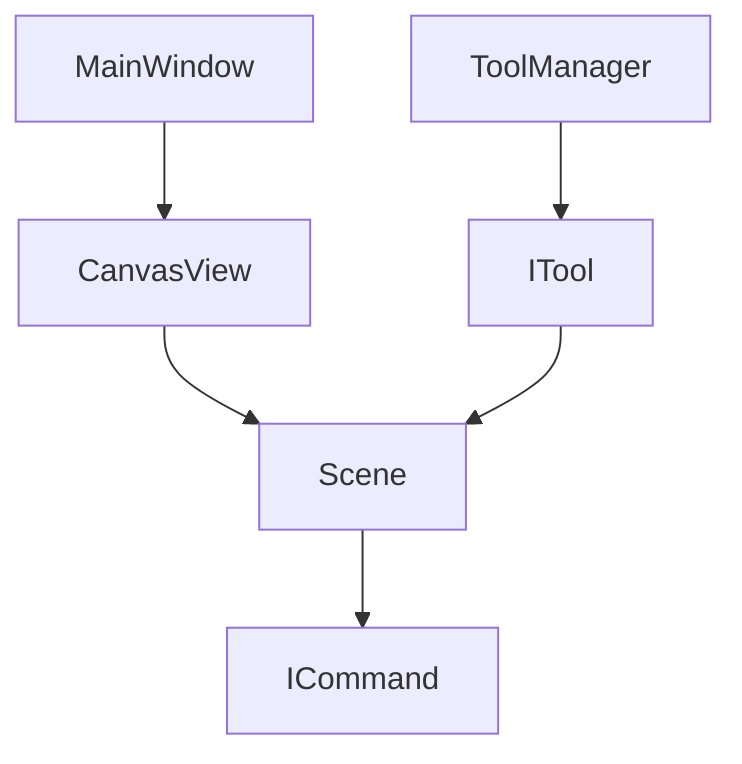
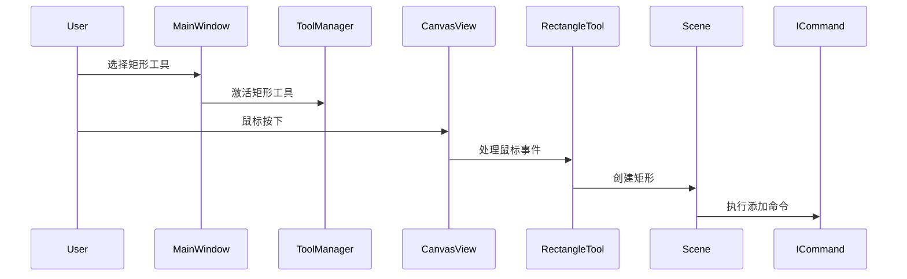
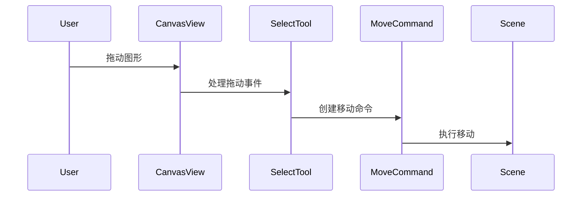

# Painter

## 项目概述

Painter 是一个所见即所得的画图软件，使用 Qt6 和 C++17 开发。提供了丰富的绘图工具和图形编辑功能。

## 主要功能

1. 基础绘图
   - 矩形(支持正方形)
   - 椭圆(支持圆形)
   - 多边形
   - 直线
   - 自由曲线(支持压力感应)

2. 编辑功能
   - 选择(单选/框选)
   - 删除
   - 组合/解组
   - 撤销/重做

3. 视图控制
   - 缩放(Ctrl + 滚轮)
   - 旋转(Shift + 滚轮)

4. 画笔设置
   - 颜色选择
   - 画笔大小
   - 不透明度

## 技术栈

- C++17
- Qt 6.8.3
- CMake 3.30.5
- MinGW 编译器

## 项目结构

```
painter/
├── apps/                    # 应用程序入口
│   └── main.cpp            # 主函数
├── modules/                 # 核心模块
│   ├── color/              # 颜色处理模块
│   ├── commands/           # 命令模式实现
│   ├── common/             # 通用工具
│   ├── tools/              # 工具类
│   │   ├── drawtools/     # 绘图工具 
│   │   ├── edittools/     # 编辑工具
│   │   └── viewtools/     # 视图工具
│   └── vision/            # UI 视图模块
├── CMakeLists.txt         # CMake 配置
└── resources.qrc          # Qt 资源文件
```

## 模块说明

### 颜色模块 (color/)
- `colorfield` - 颜色选择器实现
- `pencontrol` - 画笔控制器
- `icolor` - 颜色接口定义

### 命令模块 (commands/)
实现命令模式，支持撤销/重做功能
- `icommand` - 命令接口
- `groupcommand` - 组合/解组命令
- `movecommand` - 移动命令

### 工具模块 (tools/)

#### 绘图工具 (drawtools/)
- 矩形工具
- 椭圆工具
- 多边形工具 
- 直线工具
- 自由曲线工具

#### 编辑工具 (edittools/)
- 选择工具
- 删除工具
- 组合工具

#### 视图工具 (viewtools/) 
- 旋转视图工具
- 缩放工具

### 视图模块 (vision/)
- `canvasview` - 画布视图
- `mainwindow` - 主窗口

## 整体架构



## 核心类职责

### 1. MainWindow (主窗口)
- 作为应用程序的主界面容器
- 管理工具栏、菜单栏等 UI 元素
- 持有 CanvasView 实例
- 处理全局快捷键和菜单事件

### 2. CanvasView (画布视图)
- 继承自 QGraphicsView
- 负责视图的显示和交互
- 管理场景的缩放、旋转等视图操作
- 将用户输入事件转发给当前激活的工具
- 持有 Scene 实例

### 3. Scene (场景)
- 继承自 QGraphicsScene
- 管理所有图形项的容器
- 维护图形项的选择状态
- 执行命令（Command）来修改场景
- 维护撤销/重做栈

### 4. Tool (工具)
- 所有具体工具的基类是 ITool
- 处理鼠标事件和键盘事件
- 根据用户操作创建相应的命令
- 工具类型:
  - DrawTool: 绘图工具基类
  - EditTool: 编辑工具基类
  - ViewTool: 视图工具基类

### 5. Command (命令)
- 所有命令的基类是 ICommand
- 封装对场景的修改操作
- 支持撤销/重做
- 典型命令:
  - MoveCommand: 移动图形
  - GroupCommand: 组合/解组图形

## 交互流程示例

1. 绘制矩形的流程:


2. 移动图形的流程:


## 设计模式应用

1. **命令模式**
- 用于实现撤销/重做功能
- 将所有操作封装为命令对象

2. **策略模式**
- 不同的工具实现相同的接口
- 运行时切换不同的工具策略

3. **观察者模式**
- Scene 的变化通知 View 更新
- 工具状态变化通知 UI 更新

4. **组合模式**
- 图形项的组合和解组
- GroupCommand 实现组合操作

这种架构设计实现了良好的解耦，使得功能扩展和维护更加方便。每个类都有明确的职责，通过接口和事件来通信，避免了紧耦合。

## 编译构建

1. 配置 Qt 6.8.3 环境，并在 `build.bat` 中配置好环境变量
2. 运行 CMake 配置并编译
```sh
.\build.bat
```

## 待开发功能

1. 更丰富的属性选择
   - 线条样式
   - 力度控制

2. 文件操作功能
   - 保存/加载
   - 导出图片

3. 画板属性设置